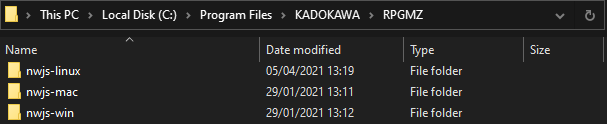

# RPGMPacker

Simple CLI program for packaging RPG Maker games to use in an automated build/deploy pipeline.

- Supported RPG Maker versions and platforms:
  - RPG Maker MV
    - Windows
    - OSX
    - Linux
    - Browser
    - Mobile: **not supported**
  - RPG Maker MZ
    - Windows
    - OSX
    - Linux: requires manual configuration, see [Linux for MZ](#linux-for-mz)
    - Browser/Mobile
- Supported deployment features:
  - image and audio encryption with an encryption key
  - using hardlinks instead of copying files
  - deploying for multiple platforms at once
  - excluding unused files

## Usage

```txt
Options:
      --help           Show help                                       [boolean]
      --version        Show version number                             [boolean]
      --input          Path to the input folder              [string] [required]
      --output         Path to the output folder             [string] [required]
      --rpgmaker       Path to the RPG Maker installation folder
                                                             [string] [required]
      --platforms      Platforms to build for
    [array] [required] [choices: "Windows", "OSX", "Linux", "Browser", "Mobile"]
      --encryptAudio   Encrypt audio files with the provided encryption key
                                                      [boolean] [default: false]
      --encryptImages  Encrypt images with the provided encryption key
                                                      [boolean] [default: false]
      --encryptionKey  Encryption key                                   [string]
      --exclude        Exclude unused files           [boolean] [default: false]
      --hardlinks      Use hardlinks instead of copying files          [boolean]
      --noempty        Remove empty folders after execution            [boolean]
  -d, --debug          Activate debug mode                             [boolean]
```

Example command:

```bash
npx rpgmpacker \
--input "E:\\Projects\\RPGMakerTest\\src\\Template" \
--output "E:\\Projects\\RPGMakerTest\\out-js\\MV" \
--rpgmaker "M:\\SteamLibrary\\steamapps\\common\\RPG Maker MV" \
--hardlinks \
--noempty \
--exclude \
--debug \
--platforms "Windows" "OSX" "Linux"
```

The `platforms` options has to come last because it accepts an array of strings. I highly recommend you use the hardlinks option for faster speeds. If you don't know what hardlinks are, take a look at the [Wikipedia article](https://en.wikipedia.org/wiki/Hard_link), the [Win32 docs](https://docs.microsoft.com/en-us/windows/win32/fileio/hard-links-and-junctions) or an [article from Linux Handbook](https://linuxhandbook.com/hard-link/).

The `exclude` option works is the same as the "Exclude Unused Files" option from the Deployment Window in RPG Maker. This was the most tedious feature to implement because it required parsing every JSON file to figure out which assets are in use and which are not. Please report any inaccuracies with this feature enabled.

## Linux for MZ

RPG Maker MZ does not include a Linux build of NW.js. If you want to provide a Linux build of your game you have to manually download the build from [here](https://nwjs.io/downloads/) and extract it to your MZ installation folder:



I don't know why they removed this option going from MV to MZ but since this is an unofficial workaround you should play-test the output before shipping it.

## Encryption

The "encryption" offered by RPG Maker is a joke. A better word might be "obfuscating". Lets take a look at the top secret highly secure encryption standards that RPG Maker employs to protect your assets:

Only image (`.png`) and audio (`.ogg` and `.m4a`) files can be encrypted. RPG Maker starts by writing a new header:

```txt
52 50 47 4D 56 00 00 00 00 03 01 00 00 00 00 00
```

The file signature is 8 bytes long: `52 50 47 4D 56 00 00 00 00` with the first 5 bytes standing for `RPGMV`, then we get 3 bytes for the version number: `00 03 01` and the rest is just filler zeroes. This header is the same for MV and MZ.

Next up is the encryption key that you provided which is hashed using MD5, an algorithm deemed insecure by NIST: `1337` -> `e48e13207341b6bffb7fb1622282247b`. The first **16 bytes** of the input file will now be manipulated using an XOR operation:

```txt
buffer[i] = buffer[i] ^ key[i]
```

There is no IV block, there is no block chaining, these are just unrelated XOR operations. Finally the unsecure MD5 hash gets written into `data/System.json`:

```json
"hasEncryptedImages": true,
"hasEncryptedAudio": true,
"encryptionKey": "e48e13207341b6bffb7fb1622282247b"
```

The entire engine is written in JavaScript so you can just open `js/rpg_core.js` and find the decryption functions if you want. This is not secure, this is no encryption, this is just obfuscating the first 16 bytes of a file and changing the file extension so users can't view the file directly.

## Projects using this tool

- Star Knightess Aura (NSFW): [itch.io](https://aura-dev.itch.io/star-knightess-aura), [gitgud](https://gitgud.io/aura-dev/star_knightess_aura/-/tree/develop/)

## Changelog

See [CHANGELOG.md](CHANGELOG.md) for the entire history.

## License

This project is under the MIT License, see [LICENSE](LICENSE) for more information.
