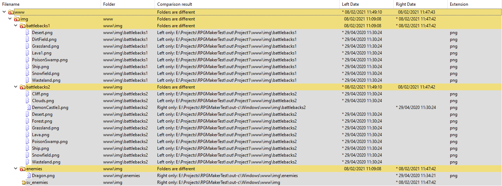

# RPGMPacker

[](https://github.com/erri120/rpgmpacker/actions?query=workflow%3A%22CI+CMake+Build%22)
[](https://github.com/erri120/rpgmpacker/releases/latest)

Simple CLI program for packaging RPG Maker games to use in an automated build/deploy pipeline.

- Supported RPG Maker versions:
  - RPG Maker MV
    - Windows
    - OSX
    - Linux
    - Browser
    - Mobile: **not supported**
  - RPG Maker MZ
    - Windows
    - OSX: **not supported**
    - Browser/Mobile
- Supported deployment features:
  - audio filtering depending on platform
  - image and audio encryption with an encryption key
  - using hardlinks instead of creating copies
  - deploying for multiple platforms at once
  - excluding unused files

## Usage

```txt
  RPGMPacker [OPTION...]

  -i, --input arg          (REQUIRED) Input folder containing the .rpgproj
                           file
  -o, --output arg         (REQUIRED) Output folder
      --rpgmaker arg       (REQUIRED) RPG Maker installation folder
  -p, --platforms arg      (REQUIRED) Platforms to build for, this can take a
                           list of platforms delimited with a comma or just
                           one value. Possible values: win, osx, linux,
                           browser, mobile
      --encryptImages      Enable Image Encryption using encryptionKey.
                           (default: false)
      --encryptAudio       Enable Audio Encryption using encryptionKey.
                           (default: false)
      --encryptionKey arg  Encryption Key for Images or Audio, either
                           encryptImages or encryptAudio have to be set
      --exclude            Exclude unused files. (default: false)
      --hardlinks          Use hardlinks instead of creating copies.
                           (default: false)
      --cache              Use a path cache for already encrypted files when
                           multi-targeting and using hardlinks. (default:
                           false)
      --threads arg        Amount of worker threads to use. Min: 1, Max: 10
                           (default: 2)
  -d, --debug              Enable debugging output (very noisy). (default:
                           false)
  -h, --help               Print usage
```

The output directory will be cleaned before execution and each platform will get it's own sub directory:

```txt
/output
/output/Windows
/output/Linux
/output/Browser
```

It is recommended to use the hardlink option for faster speeds and less disk usage. You can't hardlink across different drives and the program will check if hardlinks can be used beforehand. If you don't know what hardlinks are then take a look at the [Wikipedia article](https://en.wikipedia.org/wiki/Hard_link), the [Win32 docs](https://docs.microsoft.com/en-us/windows/win32/fileio/hard-links-and-junctions) or an [article from Linux Handbook](https://linuxhandbook.com/hard-link/).

The cache option is recommend to use when you encrypt your files, use the hardlink option and target multiple platforms. It works by encrypting the files only once, caching the path and subsequently encryption will just hardlink to the already encrypted file reducing operation speed and disk usage.

The exclude option tries to exclude as much files as possible without making the game unplayable. This is the same as the "Exclude Unused Files" feature when deploying using RPG Maker. The picture below is a comparison using the default project:



The left size was the output generated by RPG Maker and the right side was generated by RPGMPacker. The only differences are the extra battlebacks RPG Maker includes (which I can't find a reference to). I recommend testing the output when excluding unused files to make sure nothing important is missing. This feature is still rather experimental so report any problems here.

Since this application is mostly just doing IO stuff, I added parallel execution that you can configure with the threads option which will set the amount of worker threads to use. I recommend something between 2 and 4 as anything above 4 is not having that much of an impact:

| Worker Threads | Time (first platform) | Time (second platform) |
|----------------|-----------------------|------------------------|
| 1 | `4.84sec` | `0.16sec` |
| 2 | `3.28sec` | `0.11sec` |
| 4 | `1.84sec` | `0.09sec` |
| 6 | `1.66sec` | `0.10sec` |
| 8 | `1.31sec` | `0.09sec` |

For testing I used the following options:

- Input: `E:\\Projects\\RPGMakerTest\\src\\MZProject1`
- Output: `E:\\Projects\\RPGMakerTest\\out-c`
- RPG Maker: `C:\\Program Files\\KADOKAWA\\RPGMZ`
- Encryption Key: `1337`
- Encrypt Images: `true`
- Encrypt Audio: `true`
- Platforms: `win,browser`
- Debug: `false`
- Use Hardlinks: `true`
- Use Cache: `true`
- RPGMaker Version: `MZ`
- Can use hardlinking from RPGMaker Folder to Output: `false`
- Can use hardlinking from Input Folder to Output: `true`

### Example

```ps1
.\RPGMPacker.exe -i "E:\\Projects\\RPGMakerTest\\src\\Project1" -o "E:\\Projects\\RPGMakerTest\\out-c" --rpgmaker "M:\\SteamLibrary\\steamapps\\common\\RPG Maker MV" --platforms win,linux,osx --encryptImages --encryptAudio --encryptionKey="1337" --hardlinks --cache
```

### Pipeline Example and Guide

See [this](https://erri120.github.io/2021/02/04/CI-CD-for-RPG-Maker-Games/) post I made about CI/CD for RPG Maker Game Development where we build an entire release pipeline.

### GitHub Actions

Using this application in [GitHub Actions](https://github.com/features/actions) can be done by downloading a release using `wget` and then executing with configured arguments. I doubt you have your game on a public repository and should also consider using a self-hosted runner. I recommend using `ubuntu-latest` because everything is faster than on `windows-latest`.

```yml
- name: RPGMPacker
    # see https://github.com/erri120/rpgmpacker#usage for all arguments
    # see https://github.com/erri120/rpgmpacker/releases for all releases
    # note: using chmod to make sure we set execution permission, not needed on Windows
    shell: bash
    env:
        RPGMPACKER_VERSION: '1.0.0'
    run: |
        wget https://github.com/erri120/rpgmpacker/releases/download/v$RPGMPACKER_VERSION/RPGMPacker-Linux
        chmod +x ./RPGMPacker-Linux
        ./RPGMPacker-Linux -i path-to-input -o path-to-output --rpgmaker path-to-rpgm --platforms win,lnx
```

If you are using `windows-latest` for whatever reason change `RPGMPacker-Linux` to `RPGMPacker-Windows.exe`. You don't have to change the shell as `bash` works on all platforms ([GitHub Actions Docs](https://docs.github.com/en/actions/reference/workflow-syntax-for-github-actions#using-a-specific-shell)).

## How it works

RPG Maker has a very _simple_ way of deploying your game due to the fact that the game is in Javascript and no compilation is needed. What the program does is copy your project files as well as the runtime to the output directory. The runtime can be found in the RPG Maker installation folder and some project files are filtered out before copying (eg only `.ogg` audio files on Desktop).

### Encryption

The "encryption" method used by RPG Maker is the opposite of strong and is only useful if you don't want users to simply open the assets folder and look at some images.

Only image (`.png`) and audio (`.ogg` or `.m4a`) files are being encrypted. RPG Maker starts by writing a new header:

```txt
52 50 47 4D 56 00 00 00 00 03 01 00 00 00 00 00
```

The file signature is 8 bytes long: `52 50 47 4D 56 00 00 00 00` (`52 50 47 4D 56` = `RPGMV`), then 3 bytes for the version number: `00 03 01` and the rest is just filler (This file signature is the same in MV and MZ for whatever reason).

The provided encryption key will be run through an MD5 algorithm: `1337` -> `e48e13207341b6bffb7fb1622282247b` and the first 16 bytes of the file will be "encrypted" in an iteration with `buffer[i] = buffer[i] ^ key[i]`. This XOR operation is only applied on the first 16 bytes and the rest of the file stays the same.

Finally the MD5 hash of the encryption key will be put into `data/System.json`:

```JSON
    "hasEncryptedImages": true,
    "hasEncryptedAudio": true,
    "encryptionKey": "e48e13207341b6bffb7fb1622282247b"
```

Since the game is in Javascript you can easily just go to `js/rpg_core.js` and find the decryption functions as those are not even minified.

### Exclude Unused Files

This one was very interesting to work on because it required the parsing of the data files in `/data/`. Luckily RPG Maker has a set file system meaning you will always find all sound effects in `/audio/se/`, all movies in `/movies/`, all animations in `/img/animations/` and so on. What I ended up doing was parsing all data files and creating a set (`std::set<std::string>`) for each file type (animations, bgm, se, me, ...) that contains all required file names. After that we simply filter out files by checking if the file is of a specific type and then checking if the file name is in the set:

```cpp
std::set<std::string>::iterator it;
if (parent == inputPaths->bgmPath) {
    it = parsedData->bgmNames.find(name);
    return it == parsedData->bgmNames.end();
}
```

RPG Maker MZ changed how animations worked and use [Effekseer](https://github.com/effekseer/Effekseer) for particle effects. This also means they changed how those files looked like. Instead of simple pngs they are now `.efkefc` files. The main problem here is that one of those files can also reference textures or models inside `/effects/textures/` or `/effects/models`. RPGMPacker will parse these `.efkefc` files and find what other files it reference.

## Building from Source

Requirements:

- [CMake](https://cmake.org/) (see `cmake_minimum_required` in [`CMakeLists.txt`](CMakeLists.txt))
- Compiler has to support C++17

You don't have to worry about dependencies as those are handled by [CPM](https://github.com/cpm-cmake/CPM.cmake) (see [Libraries used](#libraries-used)).

## Libraries used

Managed with [CPM](https://github.com/cpm-cmake/CPM.cmake).

- [cxxopts](https://github.com/jarro2783/cxxopts) ([MIT](https://github.com/jarro2783/cxxopts/blob/master/LICENSE))
- [spdlog](https://github.com/gabime/spdlog) ([MIT](https://github.com/gabime/spdlog/blob/v1.x/LICENSE))
- [ghc::filesystem](https://github.com/gulrak/filesystem) ([MIT](https://github.com/gulrak/filesystem/blob/master/LICENSE))
- MD5 hash functions from [stbrumme/hash-library](https://github.com/stbrumme/hash-library) ([zlib](https://github.com/stbrumme/hash-library/blob/master/LICENSE))
- [Taskflow](https://github.com/taskflow/taskflow) ([MIT](https://github.com/taskflow/taskflow/blob/master/LICENSE))
- [simdjson](https://github.com/simdjson/simdjson) ([Apache-2.0](https://github.com/simdjson/simdjson/blob/master/LICENSE))

## License

See [LICENSE](LICENSE).
